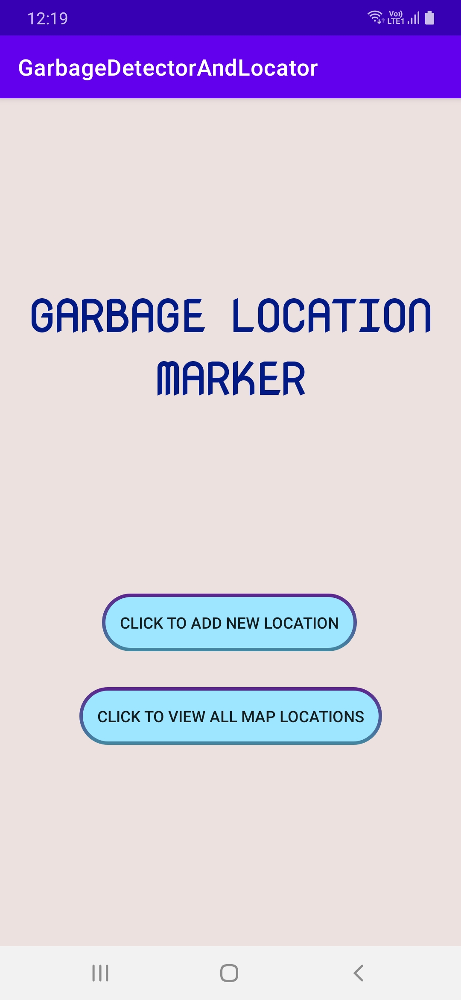
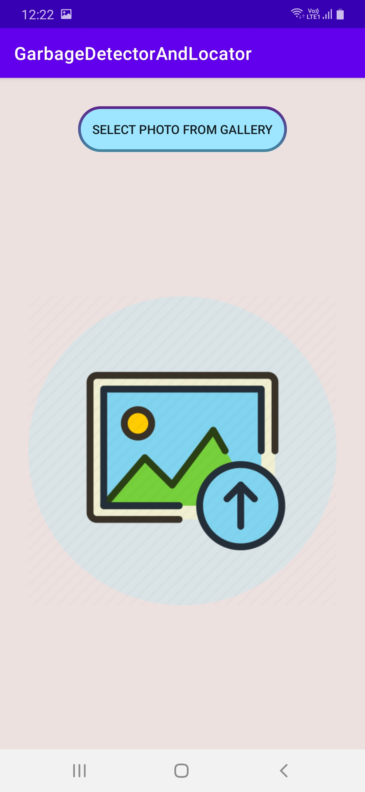
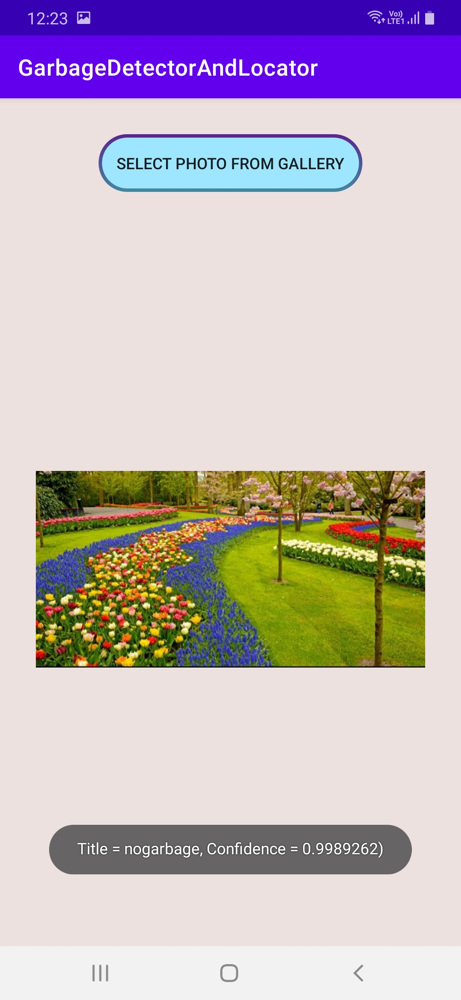
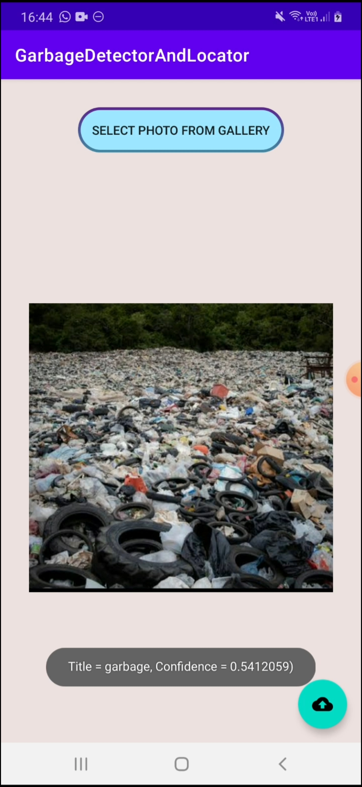
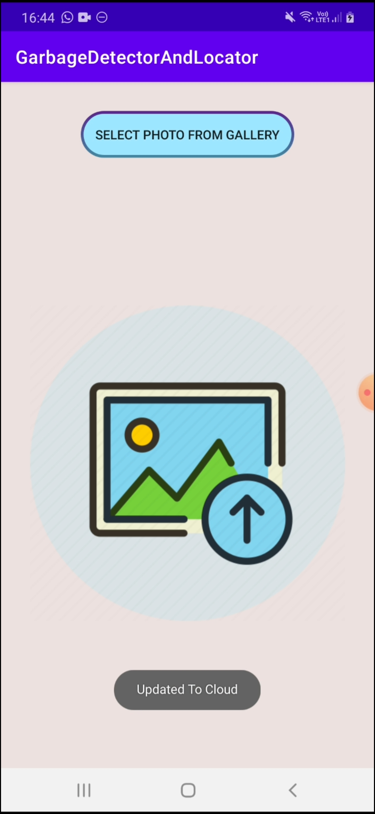
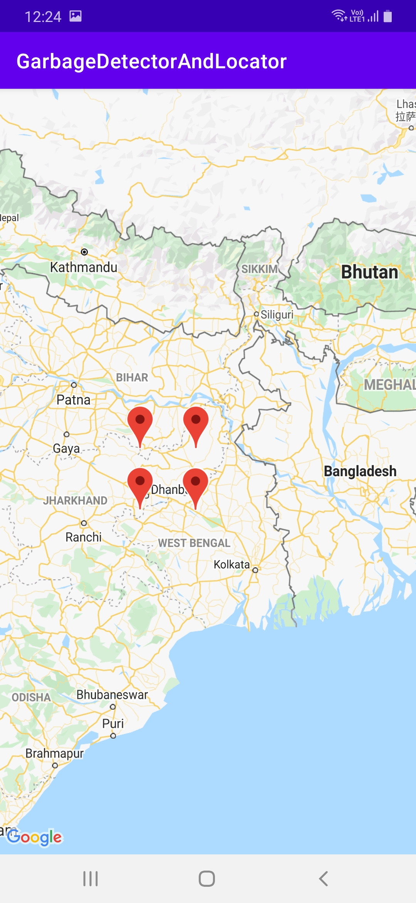
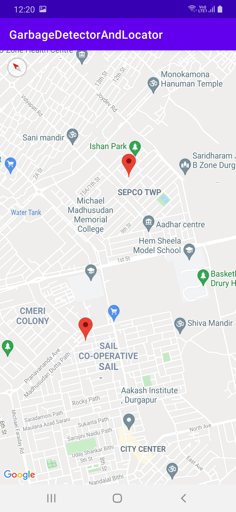

# Grbage_Detector_And_Locator

## Description

As per some of the recent reports published, in India, the pollution levels are increasing at a colossal pace annually. A significant amount of it is contributed from the ground garbage waste. The municipality bodies and local urban centers have been dictated to incorporate everyday rag pickers and trash pickers in their waste management process. But to our dismay, these rag pickers only revolve around a particular location route and pick up trash from respective residential only. But as we observe from our surroundings, there are various places such as gardens, roads, mud houses, bridges where waste accumulates and is left unattended. We need a compelling application to report these wastelands to the authorities to employ rag-pickers to get the waste cleaning done.

Speaking of applications, there are few websites or mobile applications publicly available till date through which people can upload the location to the server for authorities to react to it. But a major flaw in these applications is, there is no verification involved before updating the location in the server database. Such as what if the location registered doesn't contain any garbage in it, and people just registered a fake location just for harassing the authorities. In this way, users can spam locations, and it would be challenging for the authorities to determine the authentic locations which have garbage present in it. Thus these applications certainly don't provide trusted recordings. 

This project paper ensures that random people (users) can update the nearby garbage locations through an Android application. Before location uploading, to prevent the unnecessary upload of locations by users, the user must first scan the garbage picture. And only after that, if that picture contains garbage and crosses a particular threshold, then only the user would be given the option to upload the location. This would be made possible by using a Machine Learning-based CNN model in our application which would run the user-inputted image against the trained model. The model would classify it accordingly.

## Features

* The following is the home page of the application. It contains two buttons, i.e, Click to Add New Location and Click to View All Map Locations.

* The first button in home screen redirects to add a new garbage location. After opening it, it ask from user to upload surrounding images. Then it passes through the CNN based model which would classify the photo as Garbage present or not. 

   

* If the corresponding photo contains garbage in it, then the user gets authorized to upload location, and after successful uploading, it gets saved in cloud database.

   

* The second button is to view all the map locations which contains garbage.

   

## Built With

* Jupyter Notebook
* Android Studio -> Language - Kotlin

## Authors

* <a href="https://www.linkedin.com/in/sayantan-banerjee-iiitgwalior/">  **Sayantan Banerjee** </a>
